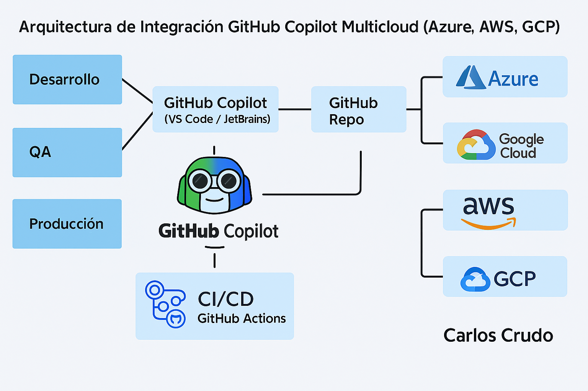

# DevSecOps-Multicloud-Blueprint 🚀

Repositorio técnico y visual profesional para desplegar una arquitectura DevSecOps multicloud enfocada en entornos Fintech.  
Incluye controles de seguridad, cumplimiento, CI/CD seguro, pruebas automatizadas, comunidad activa y documentación avanzada.

---

## 📁 Estructura del Repositorio

| Carpeta | Contenido |
|--------|-----------|
| `fintech-controls/` | Políticas y diseño seguro orientado a fintech |
| `code-security-examples/` | Buenas prácticas de seguridad en código |
| `cicd-security/` | Integraciones CI con SonarQube y Semgrep |
| `repo-protection/` | Políticas de ramas, secretos y control de cambios |
| `iam-security/` | Ejemplos para control de acceso en Azure, AWS |
| `blueprint-architecture/` | Diagramas visuales Visio/PPTX/PNG |
| `security-tests/` | Simulaciones de ataques (XSS, pruebas ofensivas) |
| `compliance/` | Checklist formal de cumplimiento fintech |
| `.github/workflows/` | Escaneos automáticos de seguridad y CI/CD |

---

## 🧩 Características Principales

- ✅ Arquitectura multinube (Azure, AWS, GCP)
- ✅ DevSecOps CI/CD integrado
- ✅ Entornos separados: Dev, QA, Producción
- ✅ Análisis de código (Semgrep), contenedores (Trivy)
- ✅ Seguridad por capas: HTTPS, mTLS, Vault/KMS, SIEM
- ✅ Cumplimiento: PCI DSS, ISO 27001, SOC 2

---

## 🤖 Integración de GitHub Copilot en Entornos Multicloud (Azure, AWS, GCP)

Este repositorio incorpora una estrategia avanzada para la adopción de **GitHub Copilot** como motor de productividad y asistencia en desarrollo seguro dentro de un entorno **DevSecOps multicloud**, compatible con:

- 🔄 GitHub Actions como plataforma unificada de CI/CD
- 🔐 Seguridad reforzada vía OIDC (Azure AD, AWS IAM, GCP Identity Federation)
- 🧱 Infraestructura como Código con **Bicep**, **Terraform**, **CDK**
- 🚧 Control de ramas por ambiente:
  - `develop` → Desarrollo (Dev)
  - `qa` → Aseguramiento (QA)
  - `main` → Producción (PRD)

📘 Ver la guía técnica: [`copilot-integracion-multicloud.md`](docs/desarrollo/copilot-integracion-multicloud.md)

📁 Ejemplos disponibles por proveedor:

| 🌐 Cloud | IaC | CI/CD Workflow |
|----------|-----|----------------|
| **Azure** | [`azure-storage.bicep`](docs/desarrollo/ejemplos/azure-storage.bicep) | [`azure-deploy.yml`](docs/desarrollo/ejemplos/github-actions/azure-deploy.yml) |
| **AWS**   | [`aws-s3-policy.tf`](docs/desarrollo/ejemplos/aws-s3-policy.tf)       | [`aws-deploy.yml`](docs/desarrollo/ejemplos/github-actions/aws-deploy.yml)     |
| **GCP**   | [`gcp-storage-bucket.tf`](docs/desarrollo/ejemplos/gcp-storage-bucket.tf) | [`gcp-deploy.yml`](docs/desarrollo/ejemplos/github-actions/gcp-deploy.yml)     |

📌 Este enfoque refuerza las prácticas DevSecOps modernas con control de código, despliegue seguro y gobernanza unificada multicloud.

---

## 📊 Actividad e Insights

- GitHub Actions: Validación automática de código seguro
- Dependency Graph: Dependencias controladas vía `requirements.txt` y `Dockerfile`
- Community Standards: 100% completado ✅
- Código abierto con licencia MIT
- Contributors visibles y trazables

---

## 🤝 Cómo Contribuir

Este repositorio acepta contribuciones bajo las siguientes condiciones:

1. Clonar y hacer fork del proyecto
2. Crear tu rama con mejoras
3. Validar con los análisis de seguridad antes de hacer PR
4. Todo el código debe estar firmado y pasar los checks automáticos

Ver más en [`CONTRIBUTING.md`](CONTRIBUTING.md)

---

## 🛡️ Seguridad y Responsabilidad

- Vulnerabilidades deben ser reportadas en [`SECURITY.md`](SECURITY.md)
- Código bajo licencia MIT – Carlos Crudo 2025 – Cloud Solutions IoT®

---

## 🏷️ Badges

✍️ Autor: **Carlos Crudo**  
🔒 Marca Registrada: **CloudSolutionsIoT® – 2025**