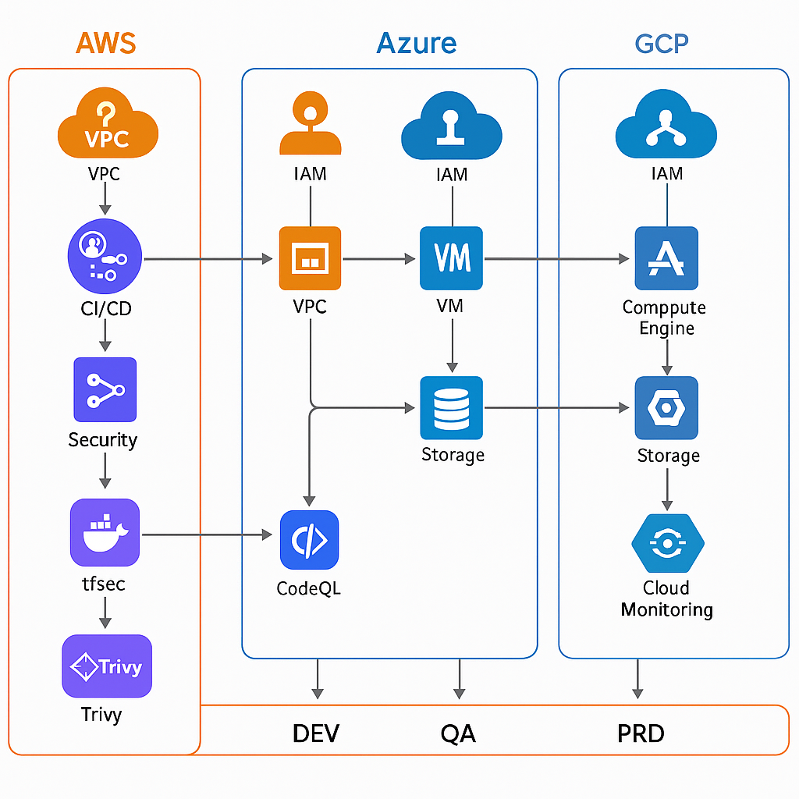
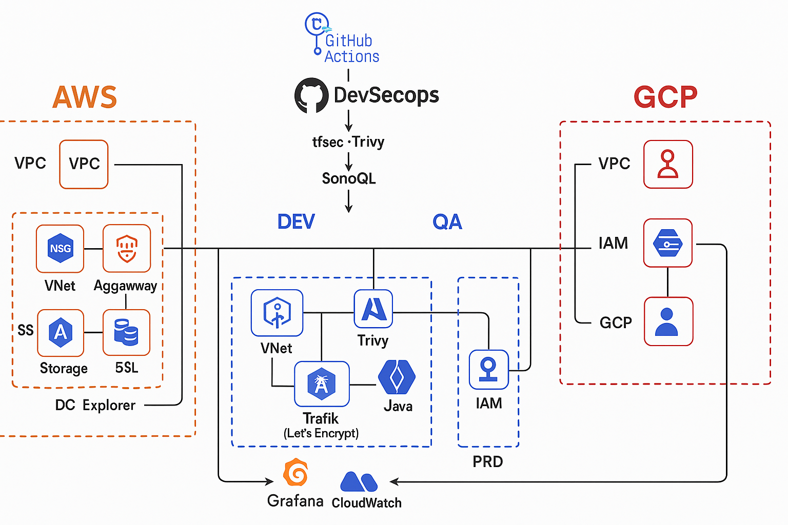
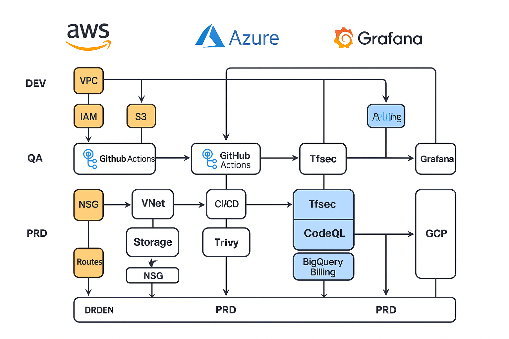

# DevSecOps-Multicloud-Blueprint 🚀

Repositorio técnico y visual profesional para desplegar una arquitectura DevSecOps multicloud enfocada en entornos Fintech.  
Incluye controles de seguridad, cumplimiento, CI/CD seguro, pruebas automatizadas, comunidad activa y documentación avanzada.

 Diagrama de arquitectura DevSecOps multicloud (AWS, Azure, GCP):

---

## 📁 Estructura del Repositorio

| Carpeta | Contenido |
|--------|-----------|
| `fintech-controls/` | Políticas y diseño seguro orientado a fintech |
| `code-security-examples/` | Buenas prácticas de seguridad en código |
| `cicd-security/` | Integraciones CI con SonarQube y Semgrep |
| `repo-protection/` | Políticas de ramas, secretos y control de cambios |
| `iam-security/` | Ejemplos para control de acceso en Azure, AWS |
| `blueprint-architecture/` | Diagramas visuales Visio/PPTX/PNG |
| `security-tests/` | Simulaciones de ataques (XSS, pruebas ofensivas) |
| `compliance/` | Checklist formal de cumplimiento fintech |
| `.github/workflows/` | Escaneos automáticos de seguridad y CI/CD |

---

## 🧩 Características Principales

- ✅ Arquitectura multinube (Azure, AWS, GCP)
- ✅ DevSecOps CI/CD integrado
- ✅ Entornos separados: Dev, QA, Producción
- ✅ Análisis de código (Semgrep), contenedores (Trivy)
- ✅ Seguridad por capas: HTTPS, mTLS, Vault/KMS, SIEM
- ✅ Cumplimiento: PCI DSS, ISO 27001, SOC 2

---

## 📊 Diagramas de Arquitectura Multicloud

A continuación se presentan los diagramas de referencia del blueprint:

### 🧭 Layout DevSecOps Integrado

### 🔁 CI/CD + Seguridad + Integración Multicloud

### 🗺️ Arquitectura General Multicloud

Consulta la [documentación extendida en blueprint-extension.md](docs/blueprint-extension.md) para más detalles técnicos.

---
## 📊 Actividad e Insights

- GitHub Actions: Validación automática de código seguro
- Dependency Graph: Dependencias controladas vía `requirements.txt` y `Dockerfile`
- Community Standards: 100% completado ✅
- Código abierto con licencia MIT
- Contributors visibles y trazables

---

## 🤝 Cómo Contribuir

Este repositorio acepta contribuciones bajo las siguientes condiciones:

1. Clonar y hacer fork del proyecto
2. Crear tu rama con mejoras
3. Validar con los análisis de seguridad antes de hacer PR
4. Todo el código debe estar firmado y pasar los checks automáticos

Ver más en [`CONTRIBUTING.md`](CONTRIBUTING.md)

---

## 🛡️ Seguridad y Responsabilidad

- Vulnerabilidades deben ser reportadas en [`SECURITY.md`](SECURITY.md)
- Código bajo licencia MIT – Carlos Crudo 2025 – Cloud Solutions IoT®

---

## 🏷️ Badges

## 🧭 Documentación Extendida

Puedes consultar detalles sobre la infraestructura AWS, Azure y scripts PowerShell en:

👉 [`docs/blueprint-extension.md`](docs/blueprint-extension.md)
